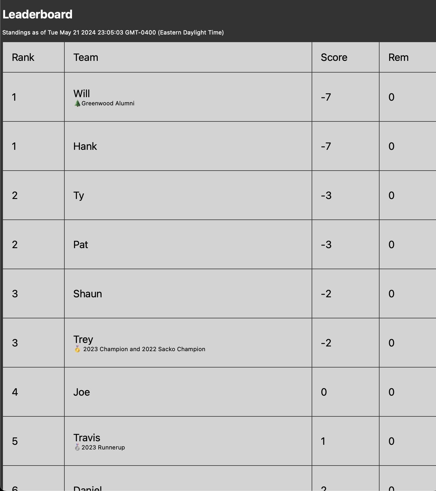
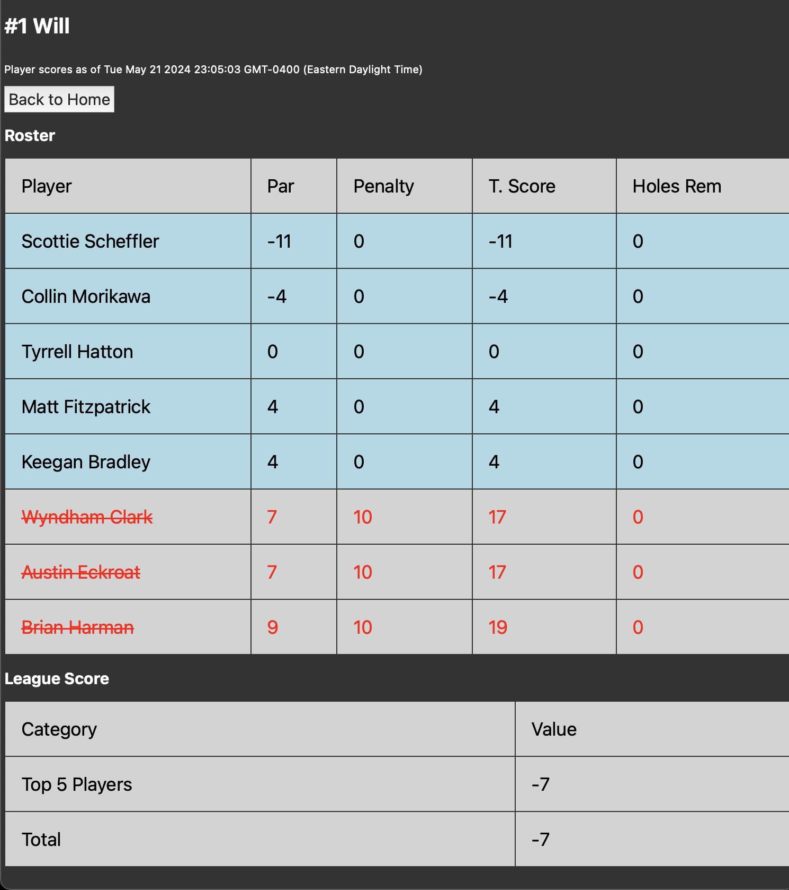

# 2024 Masters Scoreboard
This is a small client-side Javascript web application which
maintains a leaderbord of rosters in a Masters golf pool. The leaderboard
is periodically refreshed with data from `masters.com`. 

I made this application the week before the 2024 Masters so that my
friends and I would not need to calculate our scores manually.

## Screenshots
### Leaderboard View

### Team Detail View

